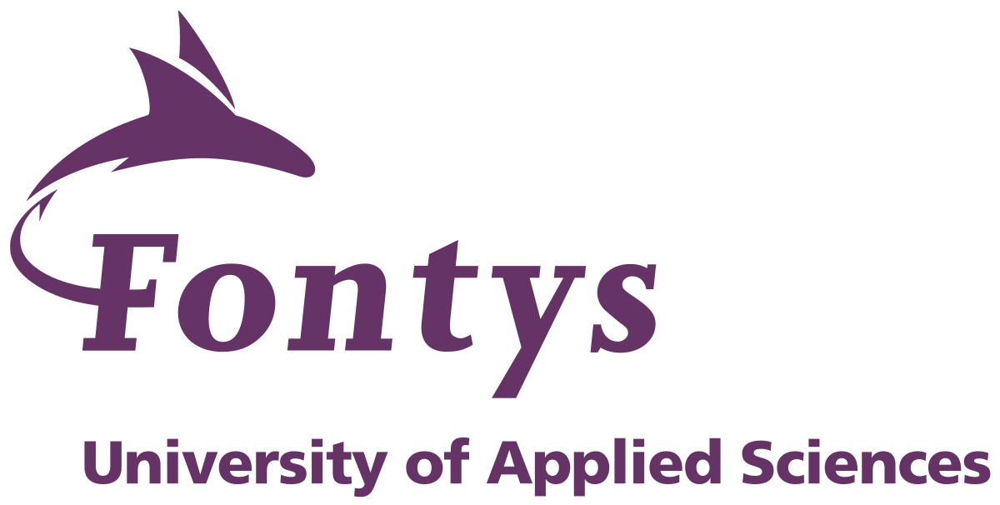

# Goalz — Loggin Sustainability Platform

> Built as the stakeholder project for **Global Acting in IT**, an international minor (Feb–June 2026) run jointly by Fontys ICT Eindhoven, FH Technikum Wien, Hellenic Mediterranean University Chania, and Humber Polytechnic Toronto.

Goalz is a location-based sustainability game built around the Humber Arboretum. Players (the **Loggin** mobile app) explore the grounds in small groups, scan IoT sensors, photograph nature elements, answer quiz questions, and earn points. Staff manage zones, sensors, and reporting from the **Dashboard**.

| Surface | Audience | Stack |
|---|---|---|
| **Loggin** (mobile) | Players (primary UI) | Expo React Native 0.81 + NativeWind |
| **Dashboard** (web) | Staff / admins | React 19 + Vite + Tailwind v4 + Leaflet |
| **API** | Both clients + IoT | ASP.NET Core 9 + EF Core + PostgreSQL / PostGIS + Supabase Storage |
| **ML service** | API (image classification) | FastAPI + ONNX, trained on Kaggle |

For the deep reference (every entity, every endpoint, every service, every config key) see **[PROJECT_DETAILS.md](PROJECT_DETAILS.md)**.

---

## Table of Contents

- [Quick Start](#quick-start)
- [Repository Layout](#repository-layout)
- [Tech Stack](#tech-stack)
- [Services & Ports](#services--ports)
- [Environment Variables](#environment-variables)
- [Common Commands](#common-commands)
- [Contributing](#contributing)
- [Documentation Map](#documentation-map)
- [Project Context & Stakeholders](#project-context--stakeholders)

---

## Quick Start

### Prerequisites

- [.NET 9 SDK](https://dotnet.microsoft.com/download/dotnet/9)
- [Node.js ≥ 20](https://nodejs.org/)
- [Docker Desktop](https://www.docker.com/products/docker-desktop/)
- [dotnet-ef CLI](https://learn.microsoft.com/en-us/ef/core/cli/dotnet): `dotnet tool install --global dotnet-ef`
- (Mobile only) [Expo Go](https://expo.dev/go) on your phone, or an Android/iOS emulator

### 1 — Clone and configure

```bash
git clone <repository-url>
cd lab4-goalz
cp .env.example .env        # fill in real secrets
```

Edit `.env` and set, at minimum:

- `POSTGRES_PASSWORD` — any local password
- `JWT_SECRET` — **32+ character random string** (the API refuses to start otherwise)

### 2 — Run the backend stack

```bash
docker compose up postgres backend
```

Swagger is live at <http://localhost:8080/swagger>. The dev override mounts source and runs `dotnet watch`, so edits hot-reload.

### 3 — Run the dashboard

```bash
cd frontend/dashboard
npm install
npm run dev        # http://localhost:5173
```

### 4 — Run the mobile app

```bash
cd frontend/mobile
cp .env.example .env            # set EXPO_PUBLIC_API_BASE_URL to your machine's LAN IP
npm install
npm start                       # scan the QR code with Expo Go
```

The API base URL **must be a LAN IP** (e.g. `http://192.168.1.12:5049`) — `localhost` won't resolve from a phone.

---

## Repository Layout

```
lab4-goalz/
├── backend/Goalz/                 # ASP.NET Core 9 solution
│   ├── Goalz.API/                   # Controllers, Program.cs, middleware
│   ├── Goalz.Application/           # Services, DTOs, interfaces (namespace: Goalz.Core.*)
│   ├── Goalz.Domain/                # Entities and enums
│   ├── Goalz.Data/                  # Active AppDbContext, repositories, migrations
│   ├── Goalz.Infrastructure/        # Legacy — not wired into runtime
│   └── Goalz.Core/                  # Orphan folder — do not add files
├── frontend/
│   ├── mobile/                    # Loggin — Expo React Native (primary UI)
│   └── dashboard/                 # Staff admin — React + Vite + Leaflet
├── ml/                             # Nature-element image classifier
│   ├── custom_model/                # Training code + Kaggle notebooks (trained on Kaggle, pulled/pushed via kaggle_pull/_kaggle_push)
│   └── serve/                       # FastAPI + ONNX inference service (deployed to Google Cloud Run)
├── database/
│   ├── README.md                  # Migration and secrets guide
│   └── schema/                    # Reference SQL dumps
├── docs/
│   ├── adr/                       # 8 architecture decision records
│   ├── diagrams/c4_models.md      # Mermaid C4 diagrams
│   ├── game_flow.md               # Full gameplay spec
│   ├── branch_conventions.md
│   └── commit_conventions.md
├── agent_docs/                    # Internal guides for AI coding assistants
├── tools/seed-zones/              # OSM → zones seeding script
├── postman/                       # Postman collection for auth testing
├── docker-compose.yml             # Full stack orchestration
├── docker-compose.override.yml    # Dev hot-reload overrides
├── .env.example                   # Template for secrets
├── .gitlab-ci.yml                 # CI: install + build for frontend + backend
├── CLAUDE.md                      # Guidance for Claude Code agents
└── PROJECT_DETAILS.md             # ⭐ Full project reference
```

---

## Tech Stack

| Layer | Technology |
|---|---|
| Mobile | Expo 54 · React Native 0.81 · React 19 · NativeWind · React Navigation 7 · `react-native-ble-plx` for sensor scanning · shipped to devices via Expo |
| Dashboard | React 19 · Vite 8 · Tailwind CSS v4 · React Router 7 · Leaflet 1.9 + Leaflet-Draw (loaded via CDN) |
| Backend | ASP.NET Core 9 · EF Core 9 · Npgsql + NetTopologySuite (PostGIS) · JWT Bearer · BCrypt · Swashbuckle |
| ML service | FastAPI + ONNX nature-element classifier, model trained on Kaggle (see [ml/](ml/) and [agent_docs/ml_pipeline.md](agent_docs/ml_pipeline.md)) |
| Database | PostgreSQL 16 (Docker locally, Supabase in prod) with PostGIS |
| Object storage | Supabase Storage (photo uploads from mobile) |
| CI/CD | GitLab CI — `install` → `build` stages |
| Hosting | Google Cloud Run — backend, dashboard, and ML service (see [docs/deployment-guide.md](docs/deployment-guide.md)) |

The rationale for each choice is captured in [docs/adr/](docs/adr/) — note that [ADR 006](docs/adr/0006_use_minio_object_storage.md) (MinIO) and [ADR 007](docs/adr/0007_host_on_azure.md) (Azure) are superseded by the Supabase Storage and Google Cloud Run setup above; the ADRs are kept as historical record but no longer reflect what's deployed.

---

## Services & Ports

When `docker compose up` is running:

| Service | URL | Purpose |
|---|---|---|
| Backend API | <http://localhost:8080> | ASP.NET Core |
| Swagger UI | <http://localhost:8080/swagger> | API docs (dev only) |
| PostgreSQL | `localhost:5432` | Database |
| Dashboard (dev) | <http://localhost:5173> | Vite dev server |
| Dashboard (Docker) | <http://localhost:3001> | Built dashboard served via Docker |
| ML service | <http://localhost:8001> | FastAPI + ONNX classifier (container port 8000) |
| Mobile (Expo) | <http://localhost:8081> | Metro bundler |

---

## Environment Variables

Copy `.env.example` → `.env` and fill in values. All listed below:

| Variable | Where used | Notes |
|---|---|---|
| `POSTGRES_DB` | Postgres container, backend conn string | Default: `goalz` |
| `POSTGRES_USER` | Postgres container, backend conn string | Default: `goalz` |
| `POSTGRES_PASSWORD` | Postgres container, backend conn string | **Set this** |
| `ConnectionStrings__DefaultConnection` | Backend (Supabase override) | Only if connecting to Supabase |
| `ASPNETCORE_ENVIRONMENT` | Backend | `Development` / `Production` |
| `JWT_SECRET` | Backend | **Must be ≥ 32 chars** or startup fails |

Mobile app has its own `frontend/mobile/.env`:

| Variable | Description |
|---|---|
| `EXPO_PUBLIC_API_BASE_URL` | LAN IP + port of the running API, e.g. `http://192.168.1.12:5049` |

ASP.NET nested config uses double-underscore: `Jwt:Secret` → `Jwt__Secret`. See [agent_docs/docker_and_env.md](agent_docs/docker_and_env.md).

---

## Common Commands

### Backend

```bash
cd backend/Goalz

# Run the API locally (no Docker)
dotnet run --project Goalz.API

# Add a migration (always use Release, target Goalz.Data)
dotnet ef migrations add <Name> --project Goalz.Data --startup-project Goalz.API --configuration Release

# Apply migrations
dotnet ef database update --project Goalz.Data --startup-project Goalz.API --configuration Release
```

> **Important:** stop the running API before building or running EF — it locks DLLs. See [CLAUDE.md](CLAUDE.md#stopping-the-api) for the `taskkill` recipe.

### Dashboard

```bash
cd frontend/dashboard
npm install
npm run dev          # Vite dev server on 5173
npm run build        # production build → dist/
npm run lint
```

### Mobile

```bash
cd frontend/mobile
npm install
npm start            # Expo dev server + QR code
npm run android      # open on Android emulator
npm run ios          # open on iOS simulator (macOS only)
npm run web          # open in a browser
```

### Zone seeding

```bash
cd tools/seed-zones
npm install
node index.js --url http://localhost:8080 --email staff@goalz.ca --password ... [--dry-run]
```

Pulls Humber Arboretum features from the OSM Overpass API and posts them as zones.

---

## Contributing

We follow **Conventional Commits** and a structured branching model.

### Branches

```
main        ← production
  └── dev   ← integration
        ├── feat/<short-description>
        ├── fix/<short-description>
        ├── docs/<short-description>
        └── chore/<short-description>
```

For work tied to an issue: `feat/<issue-number>-<description>` (e.g. `feat/32-arboretum-map-zones`). Hotfixes branch from `main`.

### Commits

```
<type>(<scope>): <imperative description>

[optional body explaining why]

Closes #<issue>   ← final commit on an issue
Refs #<issue>     ← intermediate commits
```

Types: `feat`, `fix`, `docs`, `refactor`, `test`, `chore`, `ci`, `style`.

Always check `glab issue list` before starting work and reference the issue in every commit.

Full rules: [docs/branch_conventions.md](docs/branch_conventions.md) · [docs/commit_conventions.md](docs/commit_conventions.md) · [agent_docs/gitlab_workflow.md](agent_docs/gitlab_workflow.md).

---

## Documentation Map

### Start here

| Document | When to read |
|---|---|
| [PROJECT_DETAILS.md](PROJECT_DETAILS.md) | **The comprehensive reference** — architecture, entities, endpoints, auth, migrations, known issues |
| [docs/game_flow.md](docs/game_flow.md) | The full Loggin game design: phases, roles, scoring, leaderboard |
| [docs/cnn_model_explained.md](docs/cnn_model_explained.md) | How the AI nature-element classifier (CNN/ResNet) works — no ML background needed |
| [CLAUDE.md](CLAUDE.md) | Operational notes — stopping the API, running EF, dual DbContext warning |

### Architecture Decision Records

All eight ADRs live in [docs/adr/](docs/adr/):

1. [Use ASP.NET Core for backend](docs/adr/0001_use_aspnet_core.md)
2. [Use GitLab for version control, issues, CI/CD](docs/adr/0002_use_gitlab.md)
3. [Use C++ (Arduino/ESP32) for IoT firmware](docs/adr/0003_use_cpp_arduino_esp32.md)
4. [Use React + JavaScript for frontends](docs/adr/0004_use_react_javascript.md)
5. [Use PostgreSQL via Supabase](docs/adr/0005_use_postgresql_supabase.md)
6. [Use MinIO for object storage](docs/adr/0006_use_minio_object_storage.md)
7. [Host on Microsoft Azure](docs/adr/0007_host_on_azure.md)
8. [Use Mermaid for architecture diagrams](docs/adr/0008_use_mermaid_auto_diagrams.md)

### Task-focused guides (`agent_docs/`)

| File | Read when… |
|---|---|
| [project_architecture.md](agent_docs/project_architecture.md) | Exploring layer structure or the frontends |
| [adding_a_feature.md](agent_docs/adding_a_feature.md) | Adding a new entity / service / controller |
| [api_and_auth.md](agent_docs/api_and_auth.md) | Working on endpoints, JWT, rate limiting |
| [domain_model.md](agent_docs/domain_model.md) | Working with entities, PostGIS, enums |
| [docker_and_env.md](agent_docs/docker_and_env.md) | Running the stack, env vars |
| [api_endpoints.md](agent_docs/api_endpoints.md) | Looking up any existing endpoint |
| [gitlab_workflow.md](agent_docs/gitlab_workflow.md) | Starting a task — check the board first |
| [arboretum_map.md](agent_docs/arboretum_map.md) | Working on the zone map page |
| [realtime_signalr.md](agent_docs/realtime_signalr.md) | Working on party real-time updates (SignalR) |
| [ml_pipeline.md](agent_docs/ml_pipeline.md) | Working on the AI image analysis pipeline |

### Diagrams

[docs/diagrams/c4_models.md](docs/diagrams/c4_models.md) — C4 Level 1 (System Context) and Level 2 (Container) written in Mermaid; renders natively in GitLab.

---

## Project Context & Stakeholders

<p align="center">
  
  &nbsp;&nbsp;&nbsp;
  
  &nbsp;&nbsp;&nbsp;
  
  &nbsp;&nbsp;&nbsp;
  
</p>

This repo is the team project for **Global Acting in IT**, a semester-long international minor (February–June 2026) combining four 9-/6-ECTS modules taught across four partner institutes, each contributing one layer of the system:

| Module | Institute | Contribution |
|---|---|---|
| Human Centered Design | Fontys ICT Eindhoven (Netherlands) | UX research, wireframes, prototypes |
| Software Engineering | FH Technikum Wien (Austria) | Backend architecture, REST APIs, CI/CD |
| Internet of Things | Hellenic Mediterranean University, Chania (Greece) | Sensor hardware/data pipeline |
| Artificial Intelligence | Humber Polytechnic, Toronto (Canada) | Nature-element image classification |

**Built by:** 3 students from Fontys ICT Eindhoven + 1 student from FH Technikum Wien, supervised (teaching only, no code contributions) by lecturers from all four institutes.

**Real-world stakeholders** the project serves (per the minor's official brief, a "Healthy Landscape & Biodiversity Plan" tool for Humber Polytechnic):
- Humber Office of Sustainability
- Humber Arboretum
- Municipal and conservation authorities (e.g. Toronto and Region Conservation Authority)
- Educational institutions, community groups, citizen scientists, and landscape professionals

---

## License

[Goalz Non-Commercial License](LICENSE) — free to use, copy, modify, and distribute for non-commercial purposes (including coursework and non-commercial educational use). Any commercial use — anywhere money changes hands, including between institutions — requires contacting the copyright holder first to arrange a separate commercial license.

## Contact

Report bugs and feature requests via GitLab issues: `glab issue list` / `glab issue create`.
