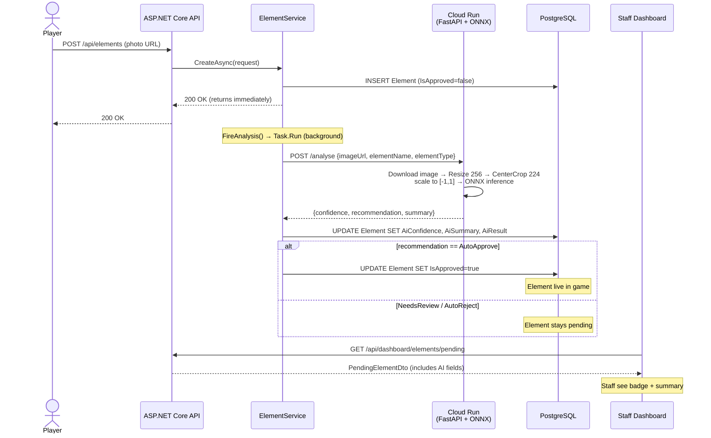
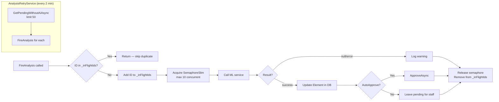
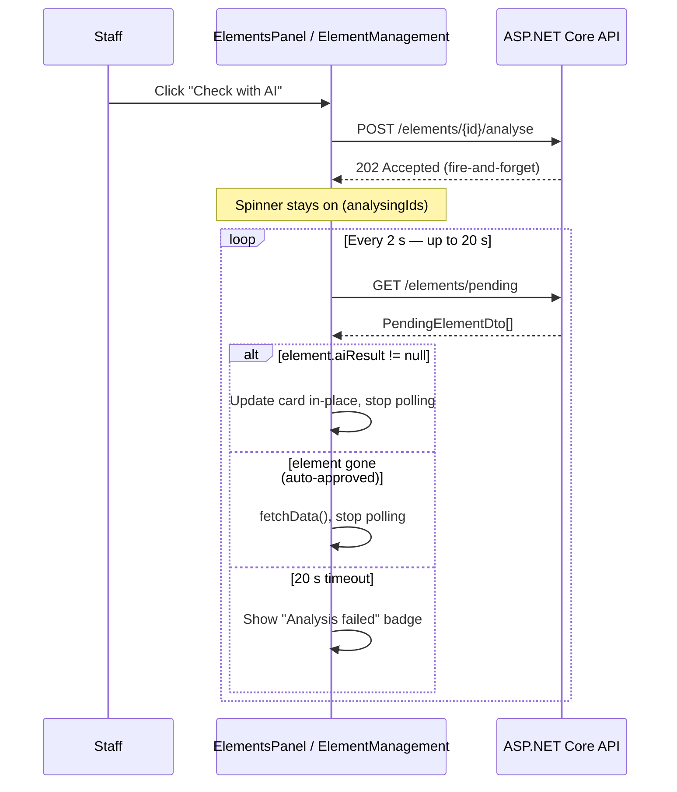

# ML Image Analysis Pipeline

> Looking for a plain-language explanation of the CNN itself (no ML background needed)? See [docs/cnn_model_explained.md](../docs/cnn_model_explained.md). This file is the technical/integration reference.

Read this file when working on:
- The ML microservice (`ml/serve/app.py`)
- `ImageAnalysisService`, `AnalysisRetryService`, or `ElementService` AI logic
- The dashboard pending-elements AI UX
- Retraining or evaluating the ONNX model

---

## Overview

When a player submits a nature element photo the backend fires a background call to a Cloud Run Python microservice that runs **NatureResNet9** — a custom 9-class ResNet trained from scratch (not EfficientNetB0; that was an earlier prototype, fully replaced — see `ml/custom_model/` and commit `5242cca`). The result is written back to the element and surfaced as a badge in the staff dashboard.

The 9 classes: `not_nature` (the reject gate), `tree`, `shrub`, `grass_lawn`, `mulch`, `garden_bed`, `ground_cover`, `green_roof`, `water_body`.

---

## End-to-End Flow



---

## Confidence Thresholds

`get_recommendation()` in `ml/serve/app.py` uses **asymmetric** thresholds — the `not_nature` class has its own, lower gate:

| Predicted class | Confidence | Recommendation | Auto-action |
|---|---|---|---|
| `not_nature` | ≥ 0.55 | `AutoReject` | None — staff decide (advisory only) |
| `not_nature` | < 0.55 | `NeedsReview` | None — staff decide |
| any nature class | ≥ 0.85 | `AutoApprove` | Element auto-approved |
| any nature class | 0.45 – 0.84 | `NeedsReview` | None — staff decide |
| any nature class | < 0.45 | `AutoReject` | None — staff decide (advisory only) |

The `not_nature` gate (0.55) is deliberately lower than the `AutoApprove` bar (0.85): a wrongly auto-approved non-nature image bypasses review entirely, so uncertain `not_nature` predictions go to review rather than risk a false auto-reject of a valid element that happens to look urban.

> `AutoReject` is **advisory only** in all cases. Staff always have final say on rejections.

---

## Component Map


---

## Retry & Deduplication



---

## Dashboard Polling (Frontend)

After staff click **Check with AI**, the frontend keeps the spinner alive and polls `/pending` until the result appears:



---

## Neural Network Architecture

`NatureResNet` (`ml/custom_model/model.py`) — a custom ResNet built from scratch (PyTorch, not a pretrained backbone):

```
Input image
    ↓
Resize(256) → CenterCrop(224) → scale to [-1, 1] → channels-first   (B, 3, 224, 224)
    ↓
Stem: Conv3×3 stride2 → BN → ReLU → MaxPool2×2                       (B, 32, 56, 56)
    ↓
Stage 1: 2× ResidualBlock(32→32,  stride1)                           (B, 32, 56, 56)
    ↓
Stage 2: 2× ResidualBlock(32→64,  first stride2)                     (B, 64, 28, 28)
    ↓
Stage 3: 2× ResidualBlock(64→128, first stride2)                     (B, 128, 14, 14)
    ↓
Stage 4: 2× ResidualBlock(128→256, first stride2)                    (B, 256, 7, 7)
    ↓
Global Average Pooling                                               (B, 256)
    ↓
Linear(256→128) → ReLU → Dropout(0.5) → Linear(128→9)
    ↓
9 raw logits (no softmax — CrossEntropyLoss applies it internally; ONNX Runtime
output is post-softmax probabilities, applied separately in app.py)
```

Each `ResidualBlock`: `Conv3×3 → BN → ReLU → Conv3×3 → BN`, added to a shortcut path (identity, or a 1×1 projection conv when shape/channels change), then a final ReLU — standard `BN → +shortcut → ReLU` ResNet design.

**Parameters:** ~2.8M total, all trained from scratch (no frozen/pretrained layers)
**Training:** two-phase — Phase A (lr=1e-3, up to 20 epochs) then Phase B fine-tuning (lr=1e-4, up to 10 epochs), both with `ReduceLROnPlateau` + early stopping. See `ml/custom_model/notebooks/goalz_cv_complete.ipynb`.
**Training platform:** Kaggle Notebooks (T4 GPU)
**Training data:** `noahbadoa/plantnet-300k-images` (nature classes) + `benjaminkz/places365` (the `not_nature` negative class)
**Export:** PyTorch → ONNX directly (`torch.onnx.export`, opset 18) — no TensorFlow/tf2onnx step, that was specific to the old EfficientNetB0 prototype.

---

## Key Files

| File | Purpose |
|---|---|
| `ml/serve/app.py` | FastAPI inference server |
| `ml/serve/model/nature_classifier.onnx` | Trained ONNX model (NatureResNet9) |
| `ml/custom_model/model.py` | `NatureResNet` / `ResidualBlock` definitions |
| `ml/custom_model/dataset.py` | Dataset loading + `train_transform`/`val_transform` (must match `app.py`'s `preprocess_image` exactly) |
| `ml/custom_model/train.py`, `evaluate.py`, `export.py` | Training loop, evaluation, ONNX export scripts |
| `ml/custom_model/notebooks/goalz_cv_complete.ipynb` | Full pipeline notebook (data prep → train → eval → export), synced from the Kaggle kernel that produced the deployed model |
| `ml/test_inference.py` | Quick local CLI inference test against `ml/serve/model/nature_classifier.onnx` |
| `backend/Goalz/Goalz.API/Services/ImageAnalysisService.cs` | HTTP client to ML service |
| `backend/Goalz/Goalz.API/Services/AnalysisRetryService.cs` | Background retry loop |
| `backend/Goalz/Goalz.Application/Services/ElementService.cs` | Fire-and-forget + dedup logic |
| `backend/Goalz/Goalz.Domain/Entities/AiRecommendation.cs` | Enum: AutoApprove / NeedsReview / AutoReject |
| `frontend/dashboard/src/components/dashboard/elements/ElementsPanel.jsx` | Card-based pending view with AI UX |
| `frontend/dashboard/src/components/dashboard/elements/ElementManagement.jsx` | Table-based pending view with AI UX |

---

## Critical Implementation Notes

- **Preprocessing must match training exactly**: `Resize(256) → CenterCrop(224) → scale to [-1, 1] → channels-first`, mirroring `val_transform` in `ml/custom_model/dataset.py`. Using standard `[0, 1]` normalisation, skipping the resize/crop step, or forgetting the channels-first transpose in `app.py` will produce garbage predictions or a shape-mismatch error.
- **AutoReject never auto-acts**: only `AutoApprove` triggers `ApproveAsync`. Rejections are always staff-confirmed.
- **Soft-delete on rejection**: `Element.IsRejected = true` keeps rejected submissions as negative training data.
- **`AnalyseAndActAsync` checks `IsRejected`** before approving — prevents AI overwriting a concurrent staff rejection.
- **OIDC token auth**: on GCP, `ImageAnalysisService` fetches a Google identity token from the metadata server and attaches it as a Bearer token. Locally this is skipped (metadata server unreachable → `null` token → no auth header).
