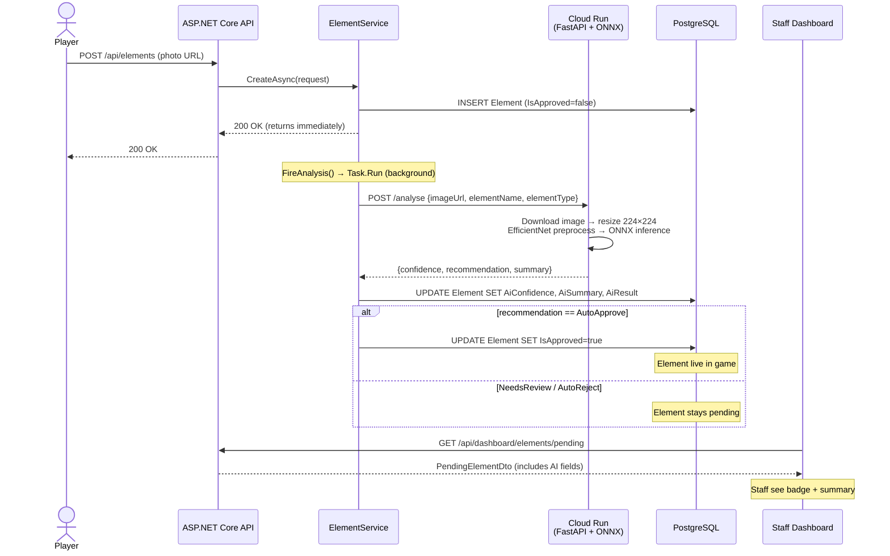
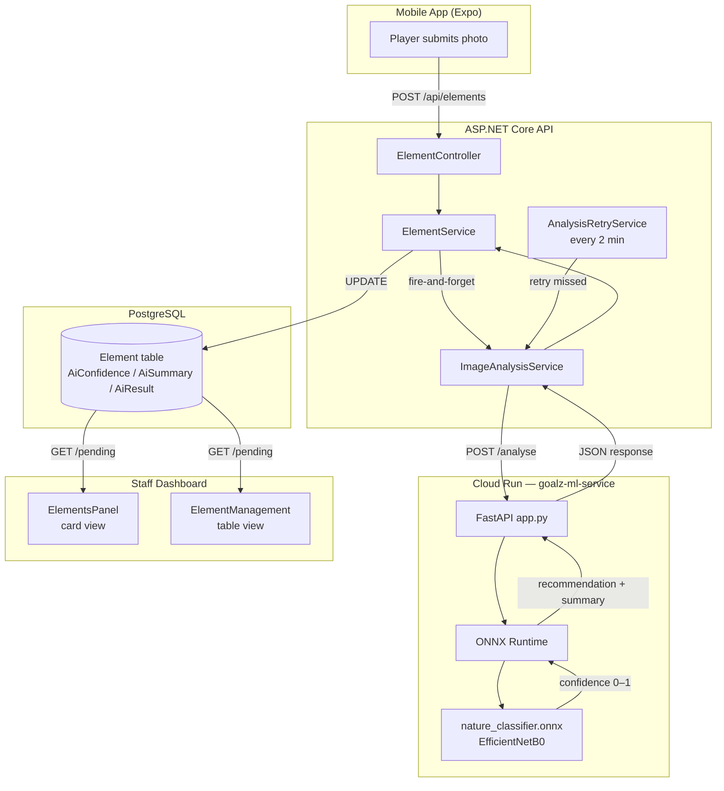
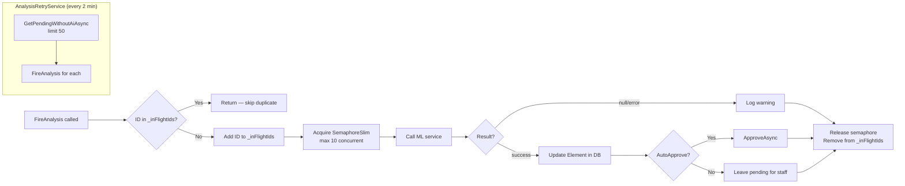
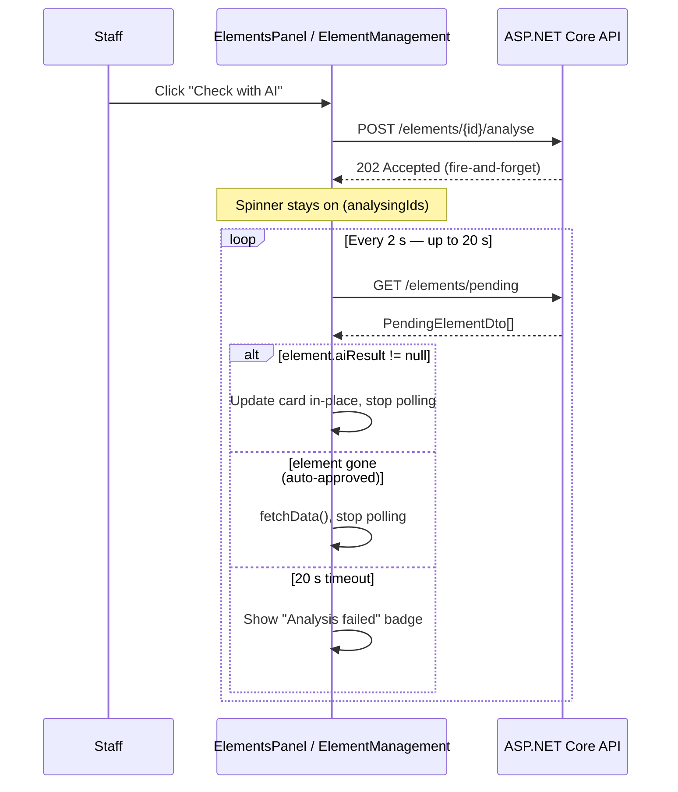

# ML Image Analysis Pipeline

Read this file when working on:
- The ML microservice (`ml/serve/app.py`)
- `ImageAnalysisService`, `AnalysisRetryService`, or `ElementService` AI logic
- The dashboard pending-elements AI UX
- Retraining or evaluating the ONNX model

---

## Overview

When a player submits a nature element photo the backend fires a background call to a Cloud Run Python microservice that runs an EfficientNetB0 binary classifier. The result is written back to the element and surfaced as a badge in the staff dashboard.

---

## End-to-End Flow



---

## Confidence Thresholds

| Score | Recommendation | Dashboard Badge | Auto-action |
|---|---|---|---|
| ≥ 0.85 | `AutoApprove` | 🟢 Likely valid | Element auto-approved |
| 0.45 – 0.84 | `NeedsReview` | 🟡 Needs review | None — staff decide |
| < 0.45 | `AutoReject` | 🔴 Suspicious | None — staff decide |

> AutoReject is **advisory only**. Staff always have final say on rejections.

---

## Component Map



---

## Retry & Deduplication



---

## Dashboard Polling (Frontend)

After staff click **Check with AI**, the frontend keeps the spinner alive and polls `/pending` until the result appears:



---

## Neural Network Architecture

```
Input image (any size)
    ↓
Resize → 224 × 224 × 3
    ↓
EfficientNet preprocess_input  (scale pixels to [-1, 1])
    ↓
EfficientNetB0 base
│  ├─ Stem conv 3×3
│  ├─ MBConv blocks × 16  (depthwise separable convolutions)
│  └─ Top conv 1×1
    ↓
Global Average Pooling 2D  (1280-dim vector)
    ↓
Dense(1) + Sigmoid
    ↓
confidence ∈ [0.0, 1.0]
```

**Parameters:** ~5.3 M total, ~4 M frozen during phase-1 fine-tuning  
**Training platform:** Kaggle Notebooks (T4 GPU, ~3.5–4 hrs full run)  
**Export:** TensorFlow → tf2onnx → `nature_classifier.onnx`

---

## Key Files

| File | Purpose |
|---|---|
| `ml/serve/app.py` | FastAPI inference server |
| `ml/serve/model/nature_classifier.onnx` | Trained ONNX model |
| `ml/notebooks/03_training.ipynb` | Training pipeline |
| `ml/notebooks/04_evaluation.ipynb` | Eval metrics |
| `backend/Goalz/Goalz.API/Services/ImageAnalysisService.cs` | HTTP client to ML service |
| `backend/Goalz/Goalz.API/Services/AnalysisRetryService.cs` | Background retry loop |
| `backend/Goalz/Goalz.Application/Services/ElementService.cs` | Fire-and-forget + dedup logic |
| `backend/Goalz/Goalz.Domain/Entities/AiRecommendation.cs` | Enum: AutoApprove / NeedsReview / AutoReject |
| `frontend/dashboard/src/components/dashboard/elements/ElementsPanel.jsx` | Card-based pending view with AI UX |
| `frontend/dashboard/src/components/dashboard/elements/ElementManagement.jsx` | Table-based pending view with AI UX |

---

## Critical Implementation Notes

- **Preprocessing must match training**: `efficientnet.preprocess_input` scales to `[-1, 1]`. Using standard `[0, 1]` normalisation in `app.py` will produce garbage predictions.
- **AutoReject never auto-acts**: only `AutoApprove` triggers `ApproveAsync`. Rejections are always staff-confirmed.
- **Soft-delete on rejection**: `Element.IsRejected = true` keeps rejected submissions as negative training data.
- **`AnalyseAndActAsync` checks `IsRejected`** before approving — prevents AI overwriting a concurrent staff rejection.
- **OIDC token auth**: on GCP, `ImageAnalysisService` fetches a Google identity token from the metadata server and attaches it as a Bearer token. Locally this is skipped (metadata server unreachable → `null` token → no auth header).
