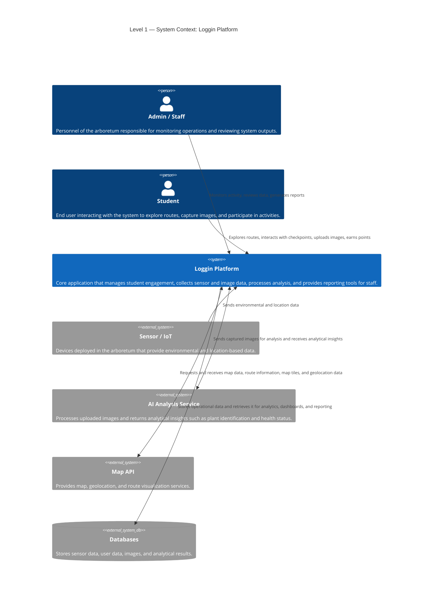
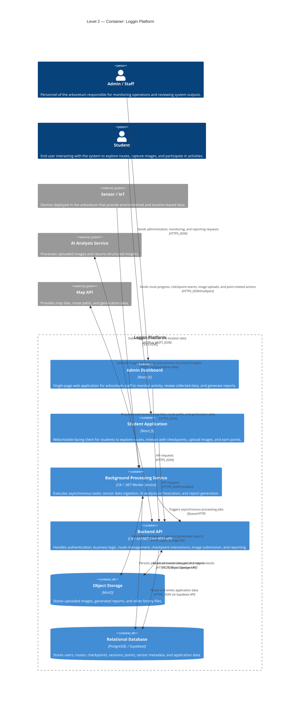
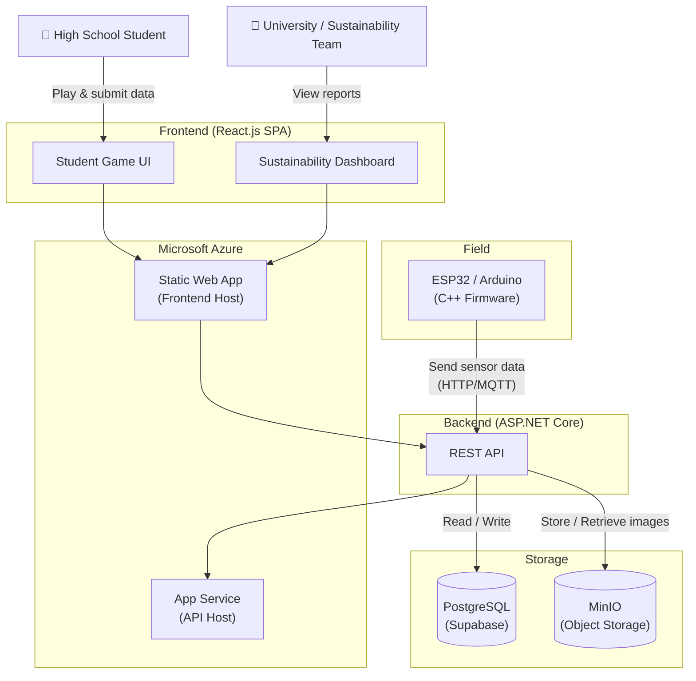
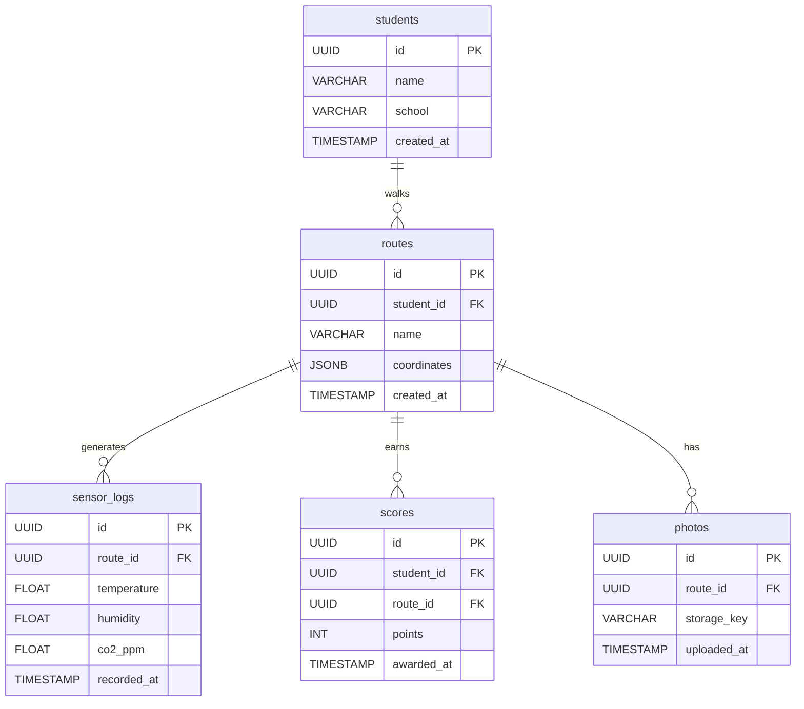
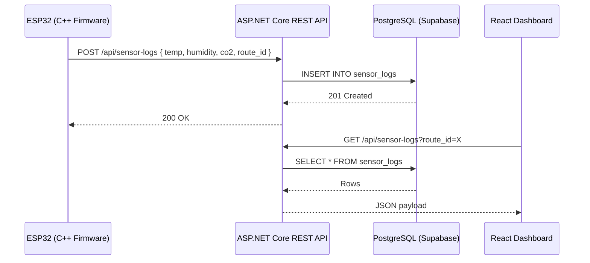

# Diagrams

Architecture diagrams for the Goalz / Loggin platform written in **Mermaid** — renders natively in GitLab with no configuration needed.

---

## C4 Level 1 — System Context

Who uses the system and what external services does it depend on.

---

## C4 Level 2 — Container

The internal building blocks of the Loggin Platform and how they communicate.

---

## System Overview

High-level component view across all layers.

---

## Database Schema

PostgreSQL entity relationships managed via Supabase.

---

## IoT Data Flow

Sequence of events from the ESP32 sensor to the dashboard.

---

## Editing a Diagram

1. Open the relevant `.mmd` source file in this folder
2. Make your changes using [Mermaid syntax](https://mermaid.js.org/intro/)
3. Copy the updated content into the matching code block above
4. Commit and push — GitLab renders the changes immediately

**Local preview:** Use the [Mermaid VS Code extension](https://marketplace.visualstudio.com/items?itemName=bierner.markdown-mermaid) or the [Mermaid live editor](https://mermaid.live/).

---

## Future: Auto-Generation via GitLab CI/CD

> Not yet implemented — see [ADR-008](../adr/0008_use_plantuml_auto_diagrams.md) for the planned approach.

The goal is a CI job that detects source code changes and automatically keeps the diagrams in sync — removing the manual copy-paste step between the `.mmd` source files and this README.
