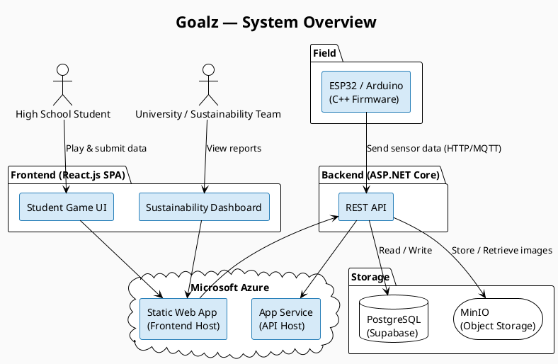
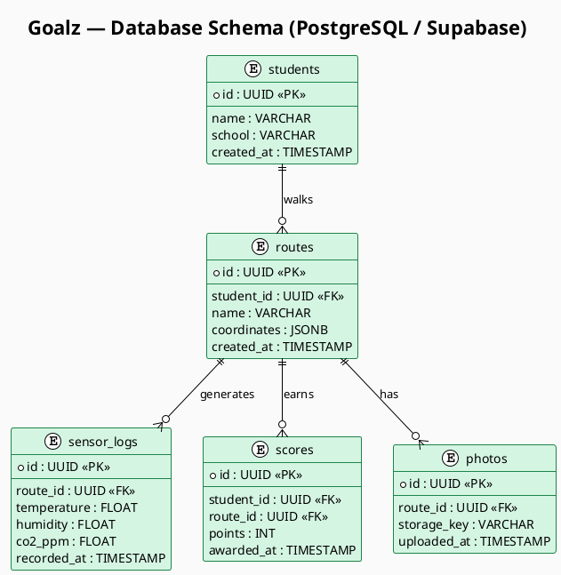
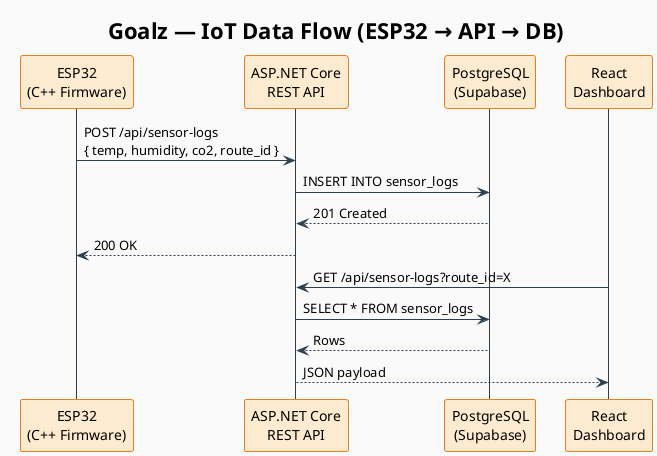

# Diagrams

Architecture diagrams for the Goalz platform. These render directly in GitLab when PlantUML integration is enabled.

> **Note for maintainers:** If diagrams are not rendering, a GitLab admin needs to enable PlantUML under
> **Admin → Settings → Integrations → PlantUML**.

---

## System Overview

High-level view of all components and how they connect.

---

## Database Schema

PostgreSQL entity relationships managed via Supabase.

---

## IoT Data Flow

Sequence of events from the ESP32 sensor to the dashboard.

---

## Editing a Diagram

1. Open the relevant `.puml` source file in this folder
2. Make your changes using [PlantUML syntax](https://plantuml.com/guide)
3. Copy the updated content into the matching code block above
4. Commit and push — GitLab will render the changes immediately

**Local preview:** Use the [PlantUML VS Code extension](https://marketplace.visualstudio.com/items?itemName=jebbs.plantuml) or the [online editor](https://www.plantuml.com/plantuml/uml/).

---

## Future: Auto-Generation via GitLab CI/CD

> Not yet implemented — see [ADR-008](../adr/0008_use_plantuml_auto_diagrams.md) for the planned approach.

The goal is a CI job that detects code changes, re-renders all `.puml` files to `.svg`, and commits them back automatically — so the README stays in sync without any manual copy-paste step.
