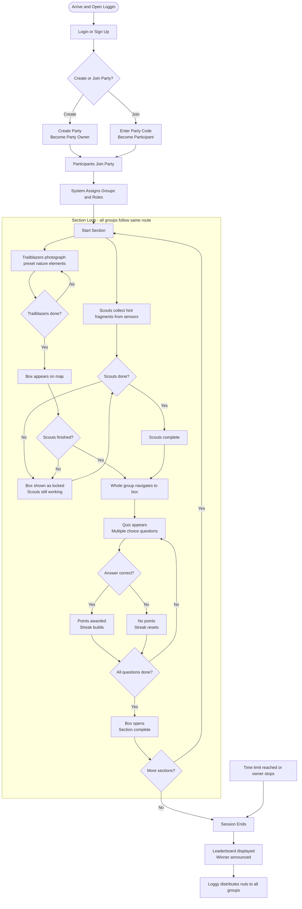

# Loggin - Game Flow

> **Platform:** Mobile web app (optimized for mobile browsers)
> **Mascot:** Loggy the squirrel, guides players through the experience

---

## Story

Loggy the squirrel hid his nuts in boxes scattered across the forest, securing each box with a set of questions. He wrote the hints to those questions on pieces of paper. One day, Hoot the owl betrayed him, pushing Loggy out of the tree and stealing the papers. As Hoot flew away, the papers were torn into many small pieces that scattered across the forest floor.

When Loggy woke up, he had forgotten both the answers to the questions and the locations of his boxes.

**Your mission:** Help Loggy find all the torn pieces of paper, recover the box locations, answer the questions, and retrieve his nuts before Hoot can steal them again.

---

## Actors

| Actor | Description |
|---|---|
| **Party Owner** | The user who creates the party, can start the session, manage groups, and force-stop the party |
| **Party Participant** | Any user who joins a party via code or invite link |
| **Scout** | In-game role assigned by the system, finds and scans sensors to collect hint fragments for the quiz |
| **Trailblazer** | In-game role assigned by the system, photographs predefined nature elements to reveal the box on the map |

> All users are equal at the account level. The only distinction is **Party Owner** vs **Party Participant**, determined by who creates the party.

---

## Phase 0 - Arrival & Authentication

> Everyone arrives at the Arboretum (or any location where the application is set up).

1. Everyone opens **Loggin** on their mobile browser
2. **New users** sign up with their name and details
3. **Returning users** log in to their existing account
4. Users are now in the lobby, ready to create or join a party

---

## Phase 1 - Party Creation

> Any user can create a party and become the Party Owner.

1. A user taps **Create Party** and becomes the **Party Owner**
2. The party is named (e.g. "Biology Class - Arboretum Visit")
3. A **party code** or **invite link** is generated
4. The Party Owner shares the code or link with the others
5. Participants enter the code or tap the link to **join the party**
6. The Party Owner sees a live list of who has joined
7. Once everyone is in, the Party Owner starts the session

---

## Phase 2 - Group & Role Assignment

> The system automatically splits users into groups and assigns each user a role.

1. The system divides users into groups
2. Each group is given a name or number (e.g. Group 1, Group 2...)
3. Within each group, the system assigns one of two roles to each user
4. Users see their group and role on their screen

| Role | Story Equivalent | Task |
|---|---|---|
| **Scout** (1-2 users) | Finding the torn paper pieces | Locate and scan sensors to collect hint fragments for the quiz |
| **Trailblazer** (1-2 users) | Helping Loggy remember where he hid his nuts | Photograph predefined nature elements at preset locations |

- All groups follow the **same route** through sections, progressing independently at their own pace
- All group members can see each other's progress in real time

---

## Phase 3 - Section Start

> The game is divided into sections (areas of the arboretum). All groups tackle the same sections in the same order.

1. The group's current **section map** is displayed
2. Scouts see the number of paper pieces to find in this section
3. Trailblazers see the preset locations they need to photograph
4. The **box location is hidden** on the map at this point
5. The group splits up and both roles begin simultaneously

---

## Phase 4A - Scout Flow

> Running in parallel with Phase 4B.

1. Scout searches the section for physical sensors hidden in the environment
2. Scout interacts with a sensor *(scan method TBD: QR code / NFC tap / BLE proximity)*
3. A **hint fragment** appears on screen momentarily
   - Example: *"The answer grows with every year the tree is alive..."*
4. **The hint disappears after viewing.** Scouts must memorize it (the paper is torn and fades away)
5. App marks that sensor as found and updates group progress (e.g. "2 of 4 paper pieces found")
6. Repeat until all sensors in the section are found
7. Once all sensors are collected, the group has **enough hints to answer the quiz**. Scout task complete

---

## Phase 4B - Trailblazer Flow

> Running in parallel with Phase 4A.

1. Trailblazer receives their assigned **preset location**, a specific spot with a defined nature element to photograph (e.g. a particular tree, rock formation, or plant)
2. The location is shown on the map to guide navigation
3. Trailblazer walks to the location and photographs the **target nature element**
4. Photo is uploaded and **verified by AI**, the system checks that the correct element was photographed
5. If verification passes, that location is marked complete
6. Once **all assigned photos are verified**, the **box appears on the group's map immediately**
7. Trailblazer task complete

> The box is visible on the map as soon as Trailblazers finish. The group can navigate to it straight away. However, if Scouts have not yet collected all sensor data, the box will be shown as **locked** with a message indicating the Scouts still need to find the remaining paper pieces before the quiz can begin.

> **AI Verification:** The system uses image recognition to confirm the photographed subject matches the predefined nature element. This keeps the game moving in real time without any manual review.

---

## Phase 5 - Convergence at the Box

1. The box appears on the map as soon as Trailblazers complete their photos
2. The group can navigate to the box at any time, they do not have to wait
3. If Scouts have not yet finished, the box is shown as **locked** with a status message (e.g. *"Scouts are still finding the paper pieces..."*)
4. Once Scouts complete their task, the box becomes **ready to open**
5. When the **full group has arrived** at the box and both tasks are done, the **quiz automatically appears**

---

## Phase 6 - Quiz

> The group stands in front of Loggy's locked box. The Scouts' memorized hints hold the answers.

1. A set of **multiple choice questions** appears, drawn from the hint fragments collected by the Scouts
2. The group decides who answers each question, or they can let the **system randomly assign** a question to a member
3. Users select their answer from the provided options. The hint fragments are no longer visible
4. **Scoring rules:**
   - Correct answer: points awarded based on speed
   - Incorrect answer: no points, and the **streak resets immediately**
   - Answering correctly **multiple times in a row** builds a **streak**, which multiplies the points earned per correct answer
   - Faster correct answers score higher within the streak bonus
5. Once all questions are answered, **the box unlocks**

> **Device sharing:** Every user is expected to use their own phone. If not everyone in a group has a device, they may share. This is left to the group to coordinate themselves.

---

## Phase 7 - Box Opens & Section Complete

1. The box plays an **opening animation**. Loggy retrieves his nuts
2. The section is marked as complete for this group
3. Scores are recorded: correctness, speed, and streak multipliers
4. The group proceeds to the **next section**, flow repeats from Phase 3
5. All groups follow the same route and complete sections at their own pace

---

## Phase 8 - Session End

> The session ends when either all groups complete all sections, the time limit is reached, or the Party Owner force-stops the party.

### End Triggers
| Trigger | Description |
|---|---|
| **All sections complete** | Every group has finished every section |
| **Time limit reached** | A preset time limit expires, all groups are pulled to the end screen |
| **Party Owner force-stops** | The party owner manually ends the session early for all groups |

### Winner Announcement
1. The **leaderboard** is displayed showing all group scores
2. Scores are calculated from:
   - **Correctness:** only correct answers earn points
   - **Speed:** faster correct answers score higher
   - **Streaks:** consecutive correct answers multiply points per question
3. The winning group is announced

### Nut Distribution (Final Reward)
4. Loggy thanks all groups by distributing his nut stash proportionally:
   - Loggy's stash = **twice the total points earned by the whole class** (story framing, he has more than enough to reward everyone)
   - Loggy distributes **50% of his stash** across all users
   - Each group's share is proportional to their score relative to the class total
   - Every group receives something, no one leaves empty-handed
   - Example: class earns 1,000 pts total, Loggy has 2,000 nuts, distributes 1,000 nuts, top group gets the largest cut
5. Final nut counts are shown per group and per user

---

## Game Loop Summary

---

## Global Leaderboard

A persistent leaderboard tracking all users across all sessions, accessible from the main screen at any time.

### Sorting Options
| Filter | Description |
|---|---|
| **This Week** | Nuts earned in the current week |
| **This Month** | Nuts earned in the current month |
| **All Time** | Total nuts earned since account creation |

- Leaderboard shows rank, username, avatar, and nut count
- Updates in real time after each session concludes
- Users can see where they rank relative to friends and the full global pool

---

## Profile

Each user has a personal profile accessible from the app at any time.

### Avatar
- Users choose from a set of **preset avatars**
- Selection only, no custom uploads

### Friends
- Users can search for and add other users as friends
- Friends appear highlighted in the global leaderboard
- A dedicated friends leaderboard view shows rankings among friends only

### Badges
Badges are awarded automatically when a user meets a defined criteria. They are displayed on the user's profile.

| Badge (example) | Criteria |
|---|---|
| **First Steps** | Complete your first section |
| **Full House** | Complete all sections in a session |
| **On Fire** | Reach a streak of 5 in a single quiz |
| **Speedy Squirrel** | Answer a question correctly in under 10 seconds |
| **Top of the Tree** | Finish 1st in a session |
| **Dedicated** | Participate in sessions across 4 different weeks |
| **Collector** | Earn a total of X nuts across all sessions |

> Badge criteria and the full badge list are to be defined. The examples above are illustrative.

---

## Open Design Decisions

| # | Question |
|---|---|
| 1 | Sensor interaction method (QR / NFC / BLE) |
| 2 | Box proximity detection (GPS geofence / manual confirm) |
| 3 | Nut distribution percentages per rank |
| 4 | Time limit - fixed or party owner configured |
| 5 | Offline capability (poor signal in forest) |
